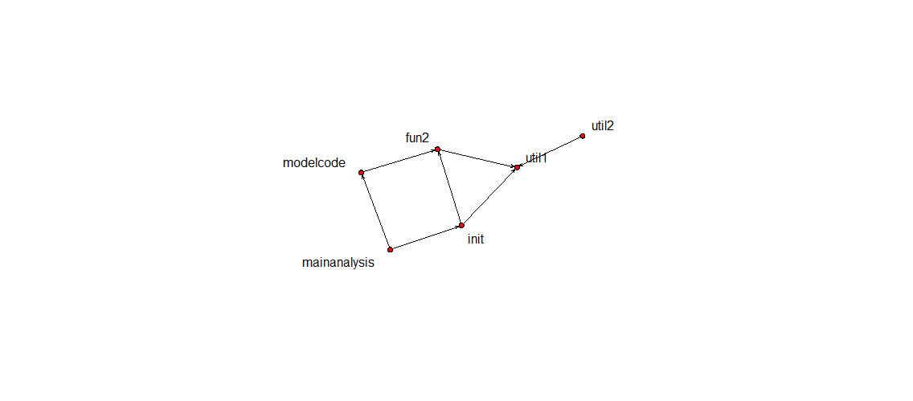
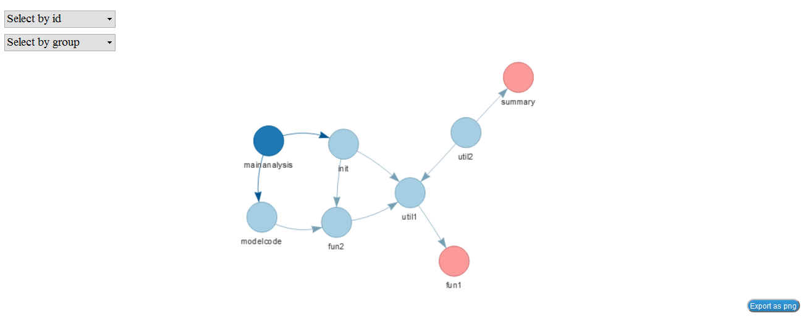

# sasMap

> Function map for SAS scripts.

- Extract counts of procs and data steps
- Draw a barplot of proc calls
- Plot static and interactive network of script dependency


## Installation
Installation from github requires the devtools package to be installed.

```R
# Install sasMap from github
devtools::install_github("MangoTheCat/sasMap", ref = "ayang")
```
## Usage
```R
# Parse SAS folder
library(sasMap)
sasDir <- system.file('examples/SAScode', package='sasMap')
sasCode <- parseSASfolder(sasDir)

# Write sas code stats to csv  
write.csv(sasCode, 'sasCode.csv', row.names = FALSE)

# List counts of proc calls
listProcs(sasDir)
 
# Draw frequency of proc calls
drawProcs(sasDir)
```


```R
# Draw network of SAS scripts. A pdf file can be created by specifying the file name.
net <- renderNetwork(sasDir)
plotSASmap(net, pdffile='static_sas_map.pdf', width=10, height=10)
```


```R
# Draw interactive force directed network graphics
plotSASmapJS(sasDir)
```


## Licence
GPL 2 © [Mango Solutions](https://github.com/mangothecat)